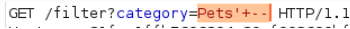

# Triển khai Lap
 ###### Truy vấn được ứng dụng sử dụng được cung cấp trong phần mô tả. Em giả định rằng chuỗi danh mục được lấy trực tiếp từ đối số URL.
 ###### `SELECT * FROM products WHERE category = '<PARAM>' AND released = 1`
 ### Find a baseline
###### Để biết đường cơ sở cho các sản phẩm đã phát hành, em lọc thú cưng hiển thị 3 mục nhập.
###### Bỏ qua phần được phát hành của truy vấn
###### Bây giờ tôi cần chèn thứ gì đó khiến phần 'AND đã phát hành = 1' bị bỏ qua, chẳng hạn như bằng cách đưa một nhận xét bỏ qua tất cả các phần còn lại của truy vấn.
###### Ví dụ: tiêm Pets'-- dẫn đến truy vấn này
###### `SELECT * FROM products WHERE category = 'Pets'--' AND released = 1`
###### Dấu `--` dùng để tạo comment trong SQL, và phần sau nó sẽ bị bỏ qua. Lỗi cú pháp sẽ bị tránh do comment bỏ qua đoạn ' AND released = 1.
### URL encode
###### mã hóa URL một cách chính xác trong Burp Repeater.

###### ==> 4 mục được hiển thị, vì vậy phần được phát hành được nhận xét thành công.
### Show all products regardless of category
###### Để hiển thị tất cả sản phẩm, bất kể danh mục hay trạng thái đã phát hành, tôi cần chèn một chuỗi đánh giá là TRUE cho mỗi mục trong bảng. Ví dụ biểu thức `1=1`.
###### `Pets' OR 1=1--` Điều này dẫn đến truy vấn
###### `SELECT * FROM products WHERE category = 'Pets' or 1=1 -- ' AND released = 1`

