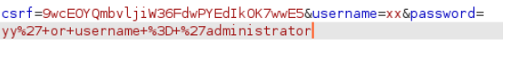

# Triển khai Lap
 ###### Truy vấn được sử dụng trong test sẽ như sau.
 ###### `SELECT * FROM users WHERE username = '<USERNAME>' AND password = '<PASSWORD>'`
 ### Đánh giá yêu cầu
###### Khi sử dụng `administrator` làm `username` và xxx làm `password`, nội dung dữ liệu của yêu cầu sẽ như sau.

###### Ít nhất một trong các tham số dễ bị tấn công bởi SQL injection.
### Nhập tên người dùng
###### Em bắt đầu bằng việc cố gắng nhập username. Để làm cho phần WHERE của truy vấn trả về thông tin của administrator, cần tránh việc kiểm tra password . Điều này có thể được thực hiện bằng cách thêm một nhận xét sau username, khiến máy chủ bỏ qua phần còn lại của truy vấn.
###### `WHERE username = 'administrator' --`
###### Điều này sẽ dẫn đến một truy vấn như
###### `SELECT * FROM users WHERE username = 'administrator' -- ' AND password = '<PASSWORD>'`
###### Lưu ý rằng trích dẫn duy nhất mà ứng dụng có thể chèn sau tên người dùng cũng sẽ bị loại bỏ.

###### Dữ liệu yêu cầu được gửi được mã hóa URL. Khi nhập nội dung vào trình duyệt, việc này sẽ được trình duyệt tự động thực hiện. Trong Burp Suite, việc này cần được thực hiện thủ công (CTRL-u)

### Nhập mật khẩu
###### Em cũng có thử nhập password. Mệnh đề WHERE ở đây sẽ thất bại vì em không biết password. Nhưng nếu em giả sử (hoặc biết) rằng tên cột của username thực sự là tên người dùng, thì em chỉ cần thêm điều kiện thứ hai sẽ thành công.
###### `WHERE username = 'xx' AND password = 'yy' or username = 'administrator'`
###### Phần được đưa vào trường mật khẩu là
###### `' or username = 'administrator`
###### Trích dẫn duy nhất kết thúc đối số password và đối số administrator  được kết thúc bằng trích dẫn duy nhất mà ứng dụng chèn sau password.
###### Tất nhiên, điều này sẽ chỉ hoạt động nếu mật khẩu được lưu dưới dạng văn bản thuần túy. Nếu không, SQL được chèn sẽ chỉ được băm và không bao giờ đến được cơ sở dữ liệu.
###### Vì trường mật khẩu không hiển thị đầu vào nên việc nhập trực tiếp vào Burp Suite Repeater sẽ thuận tiện hơn. Nội dung của trường tên người dùng sẽ bị bỏ qua.

###### Điều này cũng dẫn đến quyền truy cập vào tài khoản administrator.

