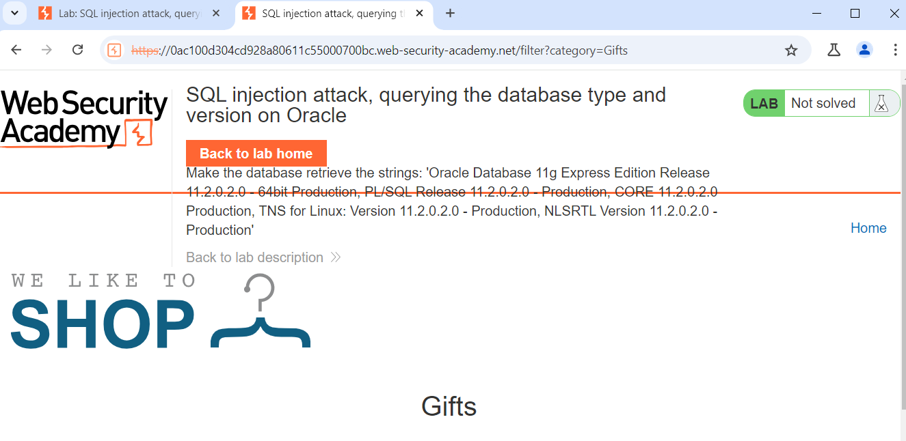
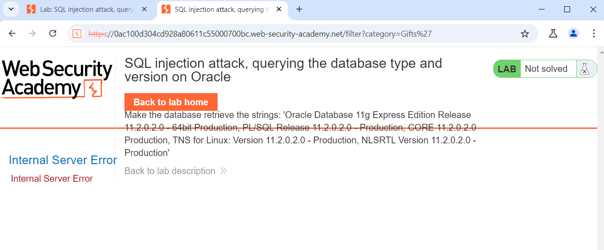
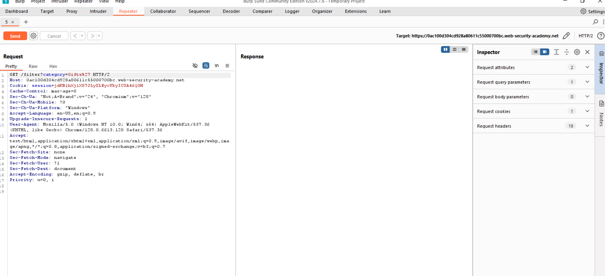
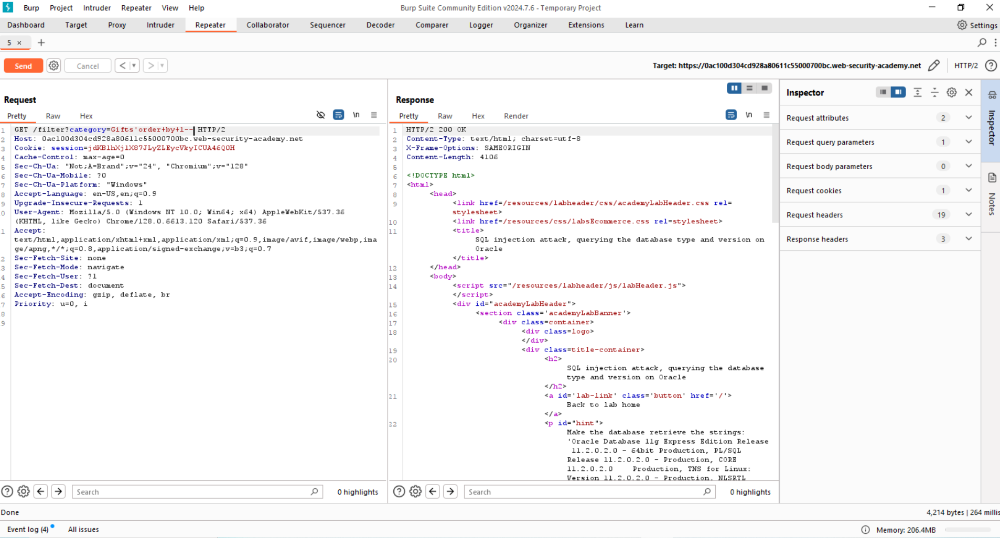
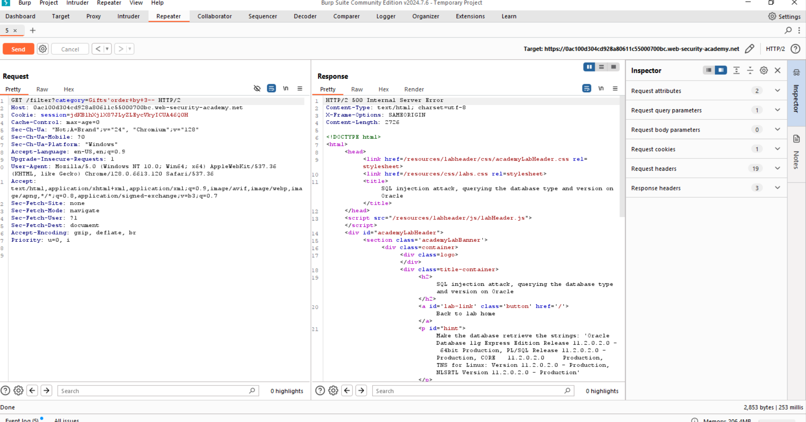
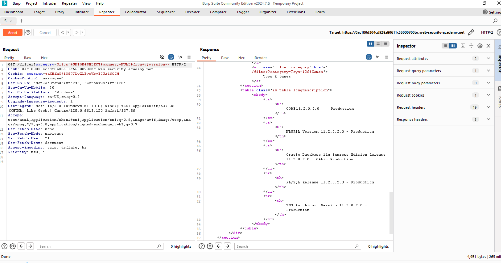

# Triển khai Lap
 ###### Đầu tiên điều hướng đến trang 'Gifts' và quan sát thông số được gửi bởi yêu cầu http như chúng ta có thể thấy em có tham số danh mục

###### Thêm dấu nháy đơn `Gifts'` để xem máy chủ có gửi lỗi nội bộ hay không.

###### Có thể quan sát yêu cầu trên proxy, gửi một số yêu cầu, sẽ gửi yêu cầu đó đến repeater.

###### Thêm lệnh SQL vào tham số danh mục của mình để quan sát lỗ hổng và bảng có 2 cột.

###### Thử đến cột thứ 3 thì phát hiện ra lỗi.

######  Lấy phiên bản cơ sở dữ liệu. Thêm `+UNION+SELECT+banner,+NULL+from+v$version--` để được thực hiện trên cơ sở dữ liệu với tư cách là người trợ giúp trên bảng cheat của trang web được đề cập

