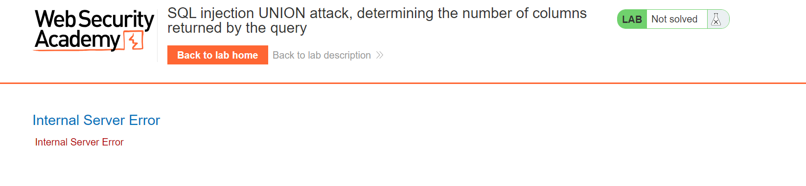
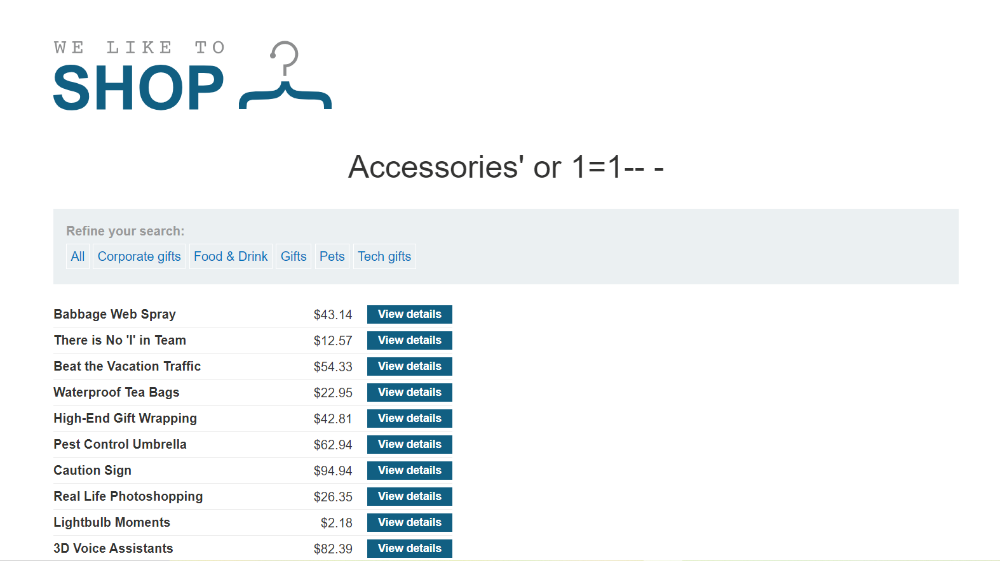
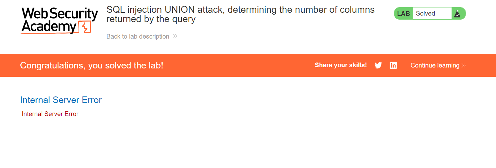
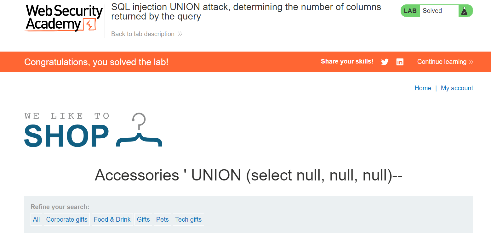
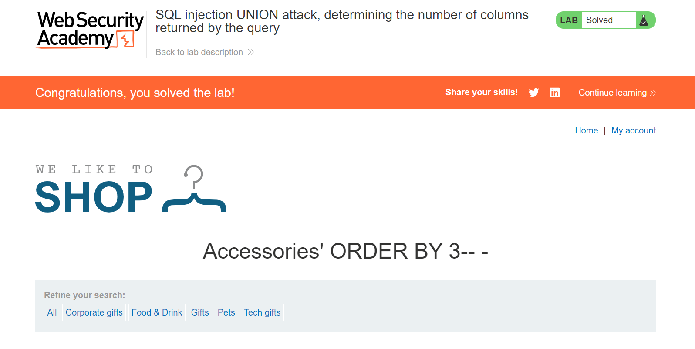
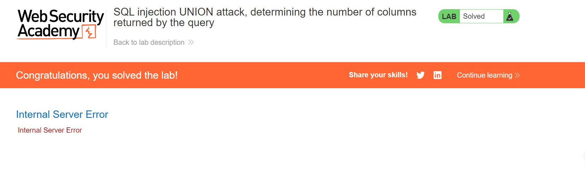

# Triển khai Lap
###### Tính năng lọc danh mục hoạt động dựa trên danh mục đối số URL. Trước tiên, em cần xác nhận rằng đối số này có thể được đưa vào bằng cách tạo ra lỗi.
###### Ví dụ: đối số thông thường là `/filter?category=Accessories`. Bắt đầu bằng cách thêm một trích dẫn vào cuối: `/filter?category=Accessories'`.
###### --> Điều này dẫn đến Lỗi Máy chủ Nội bộ của ứng dụng vì truy vấn SQL hiện không hợp lệ và sẽ trông như thế này, có một trích dẫn ko bình thường ở cuối.

 ###### Thử trường hợp tốt bằng cách đưa vào thứ gì đó dẫn đến truy vấn hợp lệ: `/filter?category=Accessories%27%20or%201=1-- -`. Điều này dẫn đến một truy vấn như thế này, trả về tất cả các hàng và nhận xét về một trích dẫn sai và bất kỳ điều gì có thể xảy ra sau đó.

######  Nó trả về danh sách đầy đủ, về cơ bản có cùng nội dung như khi không sử dụng bộ lọc. Đây là dấu hiệu cho thấy bất cứ điều gì xảy ra sau đó và được nhận xét đều không ảnh hưởng đến kết quả.
#### Đếm số cột bằng UNION SELECT
###### Trong UNION, tập kết quả cần chứa cùng số cột. Việc cho `' UNION (chọn null)-- -`sẽ gây ra lỗi máy chủ.

###### Em sử dụng các cuộc gọi lặp đi lặp lại, mỗi lần tăng số lượng 'null'. Có thể tìm thấy số lượng cột chính xác bằng cách thêm `' UNION (select null, null, null)--`. Vì vậy, truy vấn này hợp lệ:

#### Đếm số cột theo ORDER BY

###### Một cách khác để đếm các cột là sử dụng ORDER BY. Tiêm ' ORDER BY 1-- sẽ sắp xếp kết quả theo cột đầu tiên của kết quả. Việc tăng giá trị sẽ dẫn đến lỗi máy chủ nội bộ khi sử dụng ' ORDER BY 4-- vì cơ sở dữ liệu được hướng dẫn sắp xếp theo một cột không tồn tại. Vậy số cột đúng là 3.
