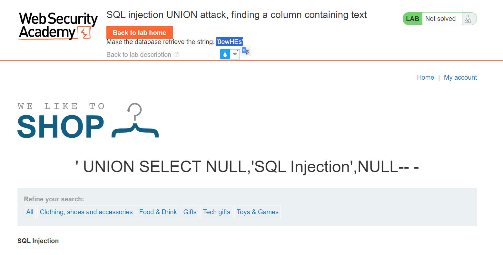

# Triển khai Lap
###### Tìm thấy lỗ hổng chèn SQL trong trang bộ lọc.
###### Tìm số col bằng `' ORDER BY 3-- -` tăng dần đến khi nào gặp lỗi.

######  Tìm cột nào chấp nhận kiểu dữ liệu chuỗi.
###### `' UNION SELECT NULL,NULL,'a'-- -`

###### Nếu kiểu dữ liệu không cho phép chuỗi, nó sẽ trả về trạng thái HTTP Lỗi máy chủ nội bộ 500.
###### Nếu kiểu dữ liệu chấp nhận chuỗi:
###### `' UNION SELECT NULL,'SQL Injection',NULL-- -`

###### ===>Nó không có lỗi!
###### Sau khi tìm đúng cột chấp nhận kiểu dữ liệu chuỗi, chúng ta có thể sử dụng cột đó để hiển thị bất cứ thứ gì!
###### `' UNION SELECT NULL,'0ewHEs',NULL-- -`

###### không chỉ có thể hiển thị chuỗi nào mình muốn mà còn có thể liệt kê cơ sở dữ liệu nhiều hơn nữa! Hoặc thậm chí lọc dữ liệu!
###### Tìm phiên bản nào của cơ sở dữ liệu này đang sử dụng:`' UNION SELECT NULL,version(),NULL-- -`

###### Chúng ta nhận thấy rằng nó đang sử dụng PostgreSQL cho DBMS (Hệ thống quản lý cơ sở dữ liệu) và phiên bản của nó là 12.20
